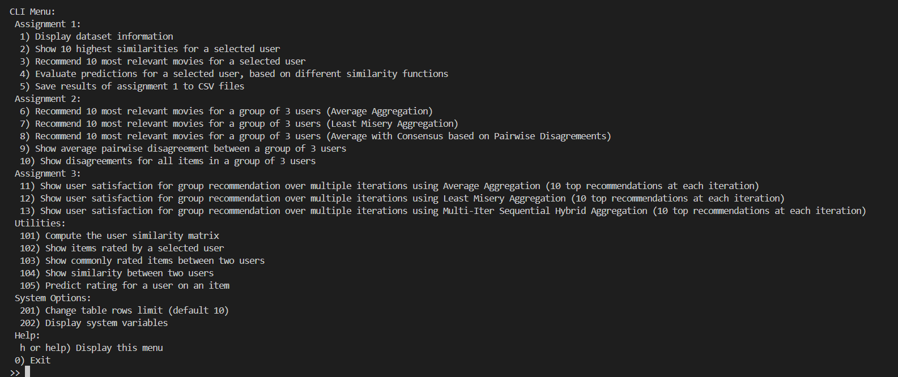

# Fairness in Group Recommendations - Assignments

Author: Alberto Tontoni

## Table of Contents
- [Description](#description)
- [How to use the application](#how-to-use-the-application)
    - [Build and Run](#build-and-run)
    - [Command Line Interface](#command-line-interface)
    - [Code Organization](#code-organization)

## Description

Group Recommendation System which uses the User-Based Collaborative Filtering approach.

A detailed explanation of the work done can be found here:
- [Assignment 1 Report - User-Based Collaborative Filtering](./reports/report-assignment1.md)
- [Assignment 2 Report - Group Recommendation](./reports/report-assignment2.md)

## How to use the application

The proposed Recommendation System has been realized as a containerized application which exposes an interactive Command Line Interface. 
Experiments results can be either inspected inside the terminal or saved to CSV files.

The code has been written in Python 3.10 with (very) minimal dependencies.

### Build and Run

The following software needs to be installed and running on your machine:
- Docker and Docker Compose
- A Bash shell

The following commands assume that the repository is downloaded locally, and your terminal working directory is the assignment folder.

To build the application, launch the script `build-app.sh`.

To run the application, launch the script `run-app.sh [SIMILARITY_FUNC] [PREDICTION_FUNC] [NUM_NEIGHBORS]`:
- `SIMILARITY_FUNC` is an optional parameter to specify the similarity function to be used by the RS. Allowed values are `pearson` (default), `jaccard` and `itr`;
- `PREDICTION_FUNC` is an optional parameter to specify the prediction function to be used by the RS. Allowed values are `mean_centered_abs` (default) and `mean_centered_no_abs` (the former is the Mean-Centered Aggregation presented above, the latter is the formula seen in class);
- `NUM_NEIGHBORS` is an optional positive integer parameter to specify the number of most similar users to compute user predictions. Default value is -1 which indicates to use all users in the dataset.

### Command Line Interface
Once launched, the application shows an interactive menu like the following:

#### Assignment 1
Commands from 1 to 4 allow to repeat the assignment tasks from A to E. 

Command 5, if selected, will prompt you to select a user and it will conduct all the assignment tasks on that user, also saving the results on different CSV files in the `results/assignment1` directory:
- Files named `most_relevant_10_items_for_user_<UserId>_<SimilarityName>.csv` contain the most relevant recommendations for user with id UserId using similarity SimilarityName;
- Files named `most_similar_10_users_for_user_<UserId>_<SimilarityName>.csv` contain the most similar users for a given user, using the given similarity;
- Files named `prediction_evaluation_user_<UserId>.csv` contain the result of the evaluation experiment mentioned above on the given user;
- Files named `user_similarity_matrix_<SimilarityName>.csv` contain the user similarity matrix of the MovieLens 100k dataset for the given similarity.

#### Assignment 2
Commands from 6 to 8, if selected, will prompt you to select 3 user ids and return the top-10 group recommendations using a different aggregation method. The setting is the same as explained in the Assigment 2 report (see the Results section).
> In case of Consensus, the values for the coefficients are w1=0.6, w2=0.4.

Commands 9, 10 are just utilities to display the disagreement of either an item or all items among a group of users.

#### Utilities
Command 101 computes the user similarity matrix for the similarity function chosen at application startup. The performances of the matrix computation have been hugely improved during development: the first implementation required approximately 30 **minutes** to compute PCC matrix on a small laptop, whereas now it takes from 4 to 10 **seconds** (you can take a look at the commit history to see how the Dataset class has been tweaked to precompute a lot of values). 
> The command is used to *compute* the matrix. It is not shown on the terminal as it is too big. Consider using a command to save it in CSV format.

The other commands are self explanatory.

#### System Options
Command 201 allows to change the number of rows displayed on the terminal during tabular results computation. This can be useful if the default number of rows is not enough for inspecting data.

Command 202 displays the environment variables of the application container. This can be useful to take a look at the current values for `SIMILARITY_FUNC`, `PREDICTION_FUNC`, and so on.

### Code Organization

The project has been implemented using the Hexagonal Architecture, which promotes high maintainability and testability. All the business logic is separated by the ways to interact with external systems. This means that the code could be easily extended to be exposed, for example, as a RESTful service instead of a CLI application. Some unit tests have been written as well.

The project source code lies in the `src/app` directory.
Here, the most interesting module is `domain`, which contains the following submodules:
- `prediction`: prediction functions implementations. Every prediction function must implement the `Prediction` interface;
- `similarity`: prediction functions implementations. Every similarity function must implement the `Similarity` interface;
- `group_prediction`: group aggregation functions that are loosely coupled to `Prediction` functions. Each function must implement the `GroupPrediction` interface;
- `recommender.py`: the recommendation system for single users;
- `group_recommender.py`: the group recommendation system;
- `dataset.py`: a class that acts as a collection with optimized read operations. Lots of values are precomputed to increase prediction and similarity computation efficiency.