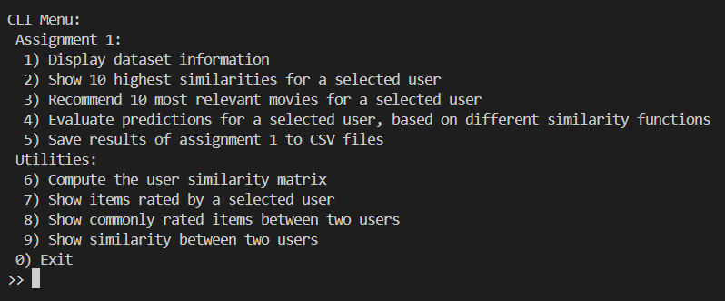

# Fairness in Group Recommendations - Assignment 1

Author: Alberto Tontoni

## Table Of Contents
- [Dataset information (Task A)](#dataset-information-task-a)
- [Design and Implementation of User-Based Collaborative Filtering (Task B, C)](#design-and-implementation-of-user-based-collaborative-filtering-task-b-c)
    - [Assumptions](#assumptions)
    - [Design](#design)
    - [Pearson Correlation Coefficient](#pearson-correlation-coefficient)
    - [Mean-Centered Aggregation](#mean-centered-aggregation)
- [Using the Recommendation System (Task D)](#using-the-recommendation-system-task-d)
- [Alternatives for the similarity function (Task E)](#alternatives-for-the-similarity-function-task-e)
    - [Jaccard Similarity](#jaccard-similarity)
- [ITR Similarity](#itr-similarity)
- [Evaluation](#evaluation)
- [Results](#results)
- [Bibliography](#bibliography)
- [How to use the application](#how-to-use-the-application)
    - [Build and Run](#build-and-run)
    - [Command Line Interface](#command-line-interface)
    - [Code Organization](#code-organization)

## Dataset information (Task A)

The MovieLens 100K small dataset consists of several CSV files about users ratings on different movies. The data of our interest is inside the `ratings.csv` file. It contains 100836 rows, each one consisting of the rating that a user has given to a particular movie. Ratings are in the 1-5 interval. Here is how the first 10 rows look like:

|   User ID |   Item ID |   Rating |
|-----------|-----------|----------|
|         1 |         1 |        4 |
|         1 |         3 |        4 |
|         1 |         6 |        4 |
|         1 |        47 |        5 |
|         1 |        50 |        5 |
|         1 |        70 |        3 |
|         1 |       110 |        4 |
|         1 |       151 |        5 |
|         1 |       157 |        5 |

## Design and Implementation of User-Based Collaborative Filtering (Task B, C)

Here is proposed a method to design a User-Based Collaborative Filtering RS which takes into account software systems qualities like performance and testability.

### Assumptions

The strongest assumption that has been made is that the given dataset is fixed ie. it doesn't change over time. Access to a read-only dataset can be optimized in many ways: for example, precomputing and caching the values that are accessed most often. This strategy is extensively used in this project to reduce the time cost of heavy computations, like the user similarity matrix.

Another assumption is that the dataset is somehow "clean": for example, there is at most 1 rating for an item by the same user. This simplification has been made so as to avoid cleaning the dataset.

### Design

A User-Based CF Recommendation System is basically made of three main software elements:

- **Similarity Calculator**: computes similarity between users. Many similarity functions do exist. The simplest ones take only into account the number of commonly rated items, whereas more complex functions also consider the rating differences between common items, or even the items not in common between two users. 
- **Predictor**: uses similarity to provide an estimate for an item not rated by a user.
- **Recommender**: recommends the items with the highest predictions to a single user who has not rated those items.

It is clear that every element depends on the previous ones. This guides a simple yet useful architectural decomposition of our system.

In the following of this section, the *Pearson Correlation Coefficient (PCC)* will be implemented to be used as a similarity measure, and the *Mean-Centered Aggregation* will be used as prediction function.

### Pearson Correlation Coefficient

This is the first similarity measure that has been implemented. It measures the similarity between two users $u,v$ and it's defined as follows:

$$
PCC(u, v) = \frac
{\sum_{i \in P}(r_{u,i} - \overline r_{u})(r_{v, i} - \overline r_{v})}
{
    \sqrt{
        \sum_{i \in P}(r_{u,i} - \overline r_{u})^2
    }
    \sqrt{
        \sum_{i \in P}(r_{v,i} - \overline r_{v})^2
    }
}
$$

where:
- $P$ is the set of items rated by both $u$ and $v$;
- $r_{u,i}$ is the rating of user $u$ for item $i$;
- $\overline r_{u}$ is the mean of the ratings of user $u$.

The similarity interval is $[-1, 1]$. An edge case to take into account in the implementation is when $P= \empty$ ie. the two users have no items in common: this indicates no correlation between users, henceforth $PCC(u,v)$ is zero in that case.

### Mean-Centered Aggregation

In general, a prediction function $pred: U \times I \to R$ takes as input a user $u$ and an item $i$ not rated by the user, and returns an estimate of the rating that $u$ would give to $i$.

The similarity function seen during classes is the following:

$$

pred(u, i) = \overline r_{u} + \frac
{\sum_{v \in N} sim(u, v) * (r_{v, i} - \overline r_v)}
{\sum_{v \in N} sim(u, v)}

$$

where:
- $\overline r_u$ is the average rating of user $u$;
- $N$ is the set of users who commonly rate item $i$;
- $sim(u, v)$ is an arbitrary similarity function.

As will be shown later, this prediction function returns ratings which are highly above or below the range 1-5 for this dataset.

Another prediction function has been considered, which is the *Mean-Centered Aggregation* defined as follows:

$$

pred(u, i) = \overline r_{u} + \frac{\sum_{v \in N} sim(u, v) * (r_{v, i} - \overline r_{v})}{\sum_{v \in N} |sim(u, v)|}

$$

The only difference with the previous formula is in the absolute value of the similarities at the denominator.

## Using the Recommendation System (Task D)

Following the previously described architecture, since we have a basic Similarity and Predictor, a Recommender can be easily implemented to predict the most relevant movies for a given user.

Here are the 10 most similar users to user with Id 1, according to the Pearson Correlation:

|   User |   Similarity |
|--------|--------------|
|    388 |     1        |
|      2 |     1        |
|     77 |     1        |
|     85 |     1        |
|    253 |     1        |
|    291 |     1        |
|    358 |     1        |
|     12 |     1        |
|    146 |     0.99905  |
|    278 |     0.971061 |

Here are the 10 most relevant movies for user with Id 1, using the prediction formula seen during classes. Note how the estimated ratings are highly outside the 1-5 interval:

|   Item |   Predicted Rating |
|--------|--------------------|
|   2149 |           741.924  |
| 112175 |           594.206  |
|   7937 |           110.904  |
|   1572 |           110.404  |
|   7820 |            73.767  |
|   2506 |            49.3286 |
|  93721 |            40.8705 |
| 167018 |            39.8106 |
|    494 |            37.1588 |
|   8405 |            37.1301 |

Here are the 10 most relevant movies for user with Id 1, using the *Mean-Centered Aggregation*:

|   Item |   Predicted Rating |
|--------|--------------------|
|   5105 |            7.79095 |
|   6967 |            7.79095 |
|   7114 |            7.79095 |
|   7742 |            7.79095 |
| 175475 |            7.5716  |
| 184641 |            7.5716  |
| 168712 |            7.46253 |
|   3604 |            7.33935 |
|  97024 |            7.14495 |
|  40491 |            7.12092 |

## Alternatives for the similarity function (Task E)

Here are proposed alternative approaches for similarity computation. Two functions are presented: the Jaccard similarity and the Improved Triangle Similarity complemented with User Rating Preferences (ITR). An simple experiment is then conducted to get an idea of which similarity function works better on the MovieLens 100K dataset. We will conclude that the Pearson Correlation works generally better than Jaccard similarity (which performs very poorly due to its simplistic approach) but worse than the ITR.

### Jaccard Similarity

The Jaccard similarity is one of the simplest similarity measures. It's defined as the cardinality of the intersection divided by the cardinality of the union of the sets of items rated by two users:

$$

J(u, v) = \frac{|u \cap v|}{|u \cup v|}

$$

The similarity interval is $[0, 1]$. The similarity is maximum (ie. 1) when $u,v$ have rated exactly the same items, and reaches its minimum (ie. 0) when $u,v$ have no commonly rated items.

Note that it doesn't take into account the actual ratings: this intuitively tells us that the predictions made using the Jaccard index may be poor (since it uses a very restricted set of information).

Here are shown the 10 most similar users to user 1 as computed by the Jaccard similarity: 

|   User |   Similarity |
|--------|--------------|
|    313 |     0.230108 |
|    330 |     0.203518 |
|    452 |     0.198895 |
|    266 |     0.194203 |
|     45 |     0.188324 |
|     57 |     0.187919 |
|    469 |     0.187394 |
|    577 |     0.187311 |
|    135 |     0.185615 |
|     39 |     0.181495 |

### ITR Similarity

The ITR similarity is defined as the product of other two similarities: the *Improved Triangle Similarity* and the *User Rating Preferences*. Therefore it's defined as follows:

$$

sim^{ITR} (u, v) = sim^{TRIANGLE'} (u, v) * sim^{URP} (u,v) 

$$

The *Improved Triangle Similarity* is defined as follows:

$$
sim^{TRIANGLE'}(u, v) = 1 - \frac
    {\sqrt{\sum_{i \in I_{uv}} (r_{ui} - r_{vi})^2}}
    {
        \sqrt{\sum_{i \in I_{uv}} r_{ui}^2} + 
        \sqrt{\sum_{i \in I_{uv}} r_{vi}^2}
    }

$$

where $I_{uv}$ is the set of items rated by **either** $u$ or $v$. If $u$ does not rate a particular item $i$, then its rating will be zero. Therefore, this similarity takes into account also items not in common between the two users.

For the *User Ratings Preferences*, the following formula has been employed:

$$

sim^{URP}(u,v) = 1 - \frac{1}{1+ + exp(-|\overline r_u - \overline r_v|*|\sigma_u - \sigma_v|)}

$$

where:
- $\overline r_u$ is the average rating of user $u$ over the set of items rated either by $u$ or $v$;
- $\sigma_u$ is the standard deviation of user $u$ ratings, using the above mentioned average and dividing by the number of items rated by $u$.

**Important note**: the implemented version for *User Rating Preferences* uses a slightly different computation for $\sigma_u$ because I've empirically noticed that prediction results are better (with respect to the specific experiment I've made). More specifically:
- The formula as presented above performs worse than Pearson Correlation;
- The tweaked formula performs better than Pearson Correlation;
- By the way, both versions perform better than Jaccard similarity.

Here are shown the 10 most similar users to user 1 as computed by the "tweaked" ITR similarity: 

|   User |   Similarity |
|--------|--------------|
|    135 |     0.208966 |
|    220 |     0.19492  |
|    186 |     0.165334 |
|    282 |     0.157513 |
|    382 |     0.156432 |
|    119 |     0.155264 |
|    522 |     0.154891 |
|    562 |     0.154257 |
|    265 |     0.152466 |
|    280 |     0.143875 |

## Evaluation

To get an idea of which similarity measure leads to better prediction, the following experiment will be conducted:
- Instantiate three recommenders $RS_{PCC}, RS_{JACCARD}, RS_{ITR}$. Both use the same prediction function but a different similarity function;
- Select all items rated by a user: for each item, do a prediction with each of the recommenders and compare the results.

The following measures of error will be used:
- Absolute Error: for each item in the dataset, the difference between the true rating and the predicted rating;
- Mean Absolute Error (MAE);
- Score: for each item, increase the counter of the predictor whose prediction led to the minimum absolute error for that item.

The best predictor is then chosen according to its MAE and score values.

## Results

Here's the result of the evaluation conducted on user with Id 1, using the three recommenders (all of them using the *Mean-Centered Aggregation* as prediction function):

| Predictor   |   Score |   Mean Absolute Error |
|-------------|---------|-----------------------|
| pearson     |      73 |              0.393644 |
| itr         |     122 |              0.334832 |
| jaccard     |      37 |              0.434312 |

It means that on this experiment, the similarity which leads to the best recommendations is ITR, since it has the highest score and lowest MAE.

## Bibliography

[1] Similarity measures for Collaborative Filtering-based Recommender Systems: Review and experimental comparison (https://www.sciencedirect.com/)

## How to use the application

The proposed Recommendation System has been realized as a containerized application which exposes a Command Line Interface. Experiments results can be either inspected inside the terminal or saved to CSV files.

### Build and Run

The following software needs to be installed on your machine:
- Docker and Docker Compose
- A Bash shell

The following commands assume that the repository is downloaded locally, and your terminal working directory is the assignment folder.

To build the application, launch the script `build-app.sh`.

To run the application, launch the script `run-app.sh [SIMILARITY_FUNC] [PREDICTION_FUNC]`:
- `SIMILARITY_FUNC` is an optional parameter to specify the similarity function to be used by the RS. Allowed values are `pearson` (default), `jaccard` and `itr`;
- `PREDICTION_FUN` is an optional parameter to specify the prediction function to be used by the RS. Allowed values are `mean_centered_abs` (default) and `mean_centered_no_abs` (the former is the Mean-Centered Aggregation presented above, the latter is the formula seen in class).

### Command Line Interface
Once launched, the application shows a menu like the following:

Commands from 1 to 4 allow to repeat the assignment tasks from A to E. 

Command 9, if selected, will prompt you to select a user and it will conduct all the assignment tasks on that user, also saving the results on different CSV files in the `assignment-01/results` directory:
- Files named `most_relevant_10_items_for_user_<UserId>_<SimilarityName>.csv` contain the most relevant recommendations for user with id UserId using similarity SimilarityName;
- Files named `most_similar_10_users_for_user_<UserId>_<SimilarityName>.csv` contain the most similar users for a given user, using the given similarity;
- Files named `prediction_evaluation_user_<UserId>.csv` contain the result of the evaluation experiment mentioned above on the given user;
- Files named `user_similarity_matrix_<SimilarityName>.csv` contain the user similarity matrix of the MovieLens 100k dataset for the given similarity.

Command 5 computes the user similarity matrix for the similarity function chosen at application startup. The performances of the matrix computation have been hugely improved during development: the first implementation required approximately 30 minutes to compute PCC matrix on a small laptop, whereas now it takes from 4 to 10 seconds (you can take a look at the commit history to see how the Dataset class has been tweaked to precompute a lot of values). 

Commands 6 to 8 are just utilities.

### Code Organization

The project has been implemented using the Hexagonal Architecture, which promotes high testability. All the business logic is separated by the ways to interact with external systems. This means that the code could be easily extended to be exposed, for example, as a RESTful service instead of a CLI application.

The project source code lies in the `src.app` directory.
Here, the most interesting module is `domain`, which contains the following submodules:
- `prediction`: contains the prediction functions implementations;
- `similarity`: contains the prediction functions implementations.